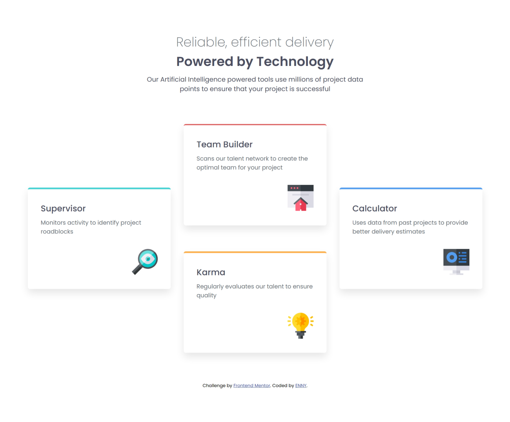
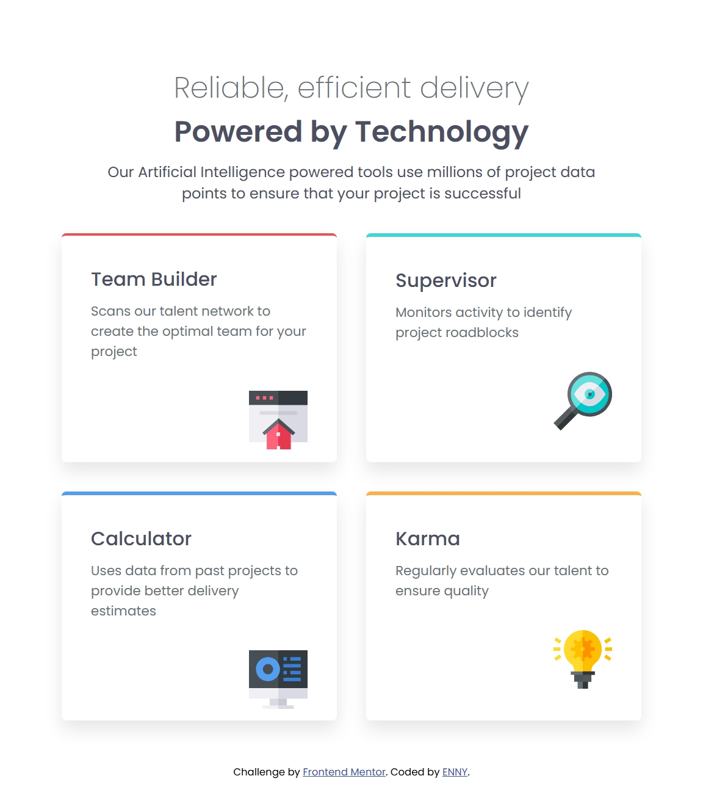
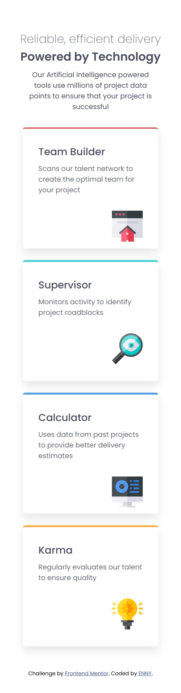

# Frontend Mentor - Four card feature section solution

This is a solution to the [Four card feature section challenge on Frontend Mentor](https://www.frontendmentor.io/challenges/four-card-feature-section-weK1eFYK). Frontend Mentor challenges help you improve your coding skills by building realistic projects. 

## Table of contents

- [Overview](#overview)
  - [The challenge](#the-challenge)
  - [Screenshot](#screenshot)
  - [Links](#links)
- [My process](#my-process)
  - [Built with](#built-with)
  - [What I learned](#what-i-learned)
  - [AI Collaboration](#ai-collaboration)
- [Author](#author)

## Overview

### The challenge

Users should be able to:

- View the optimal layout for the site depending on their device's screen size

### Screenshot

### Links

- Solution URL: [solution URL]()
- Live Site URL: [live site URL]()

## My process

### Built with

- Semantic HTML5 markup
- CSS custom properties
- Flexbox
- CSS Grid
- Mobile-first workflow

### What I learned
What I learned

During this project, I improved my understanding of CSS Grid, especially how to create layouts using grid columns, rows, and named grid areas. I also learned how to use media queries to change the layout for different screen sizes.

One thing I found particularly useful was grid-template-areas, because it allows me to visually define where each element should be placed.
.boxes {
    display: grid;
    grid-template-columns: repeat(3, 1fr);

    grid-template-areas:
        ". team_builder ."
        "supervisor . calculator"
        ". karma .";
}
grid-template-columns: repeat(3, 1fr);
@media (max-width: 800px) {
    .boxes {
        grid-template-columns: repeat(2, 1fr);

        grid-template-areas:
            "team_builder supervisor"
            "calculator karma";
    }
}

@media (max-width: 600px) {
    .boxes {
        grid-template-columns: 1fr;

        grid-template-areas:
            "team_builder"
            "supervisor"
            "calculator"
            "karma";
    }
}

### AI Collaboration

## Author

- Website - [ENNY](https://lekaneniola476-commits.github.io/clipboard-landing-page-master/)
- Frontend Mentor - [@lekaneniola476-commits](https://www.frontendmentor.io/profile/lekaneniola476-commits)
- Twitter - [@rising476](https://x.com/rising476)

